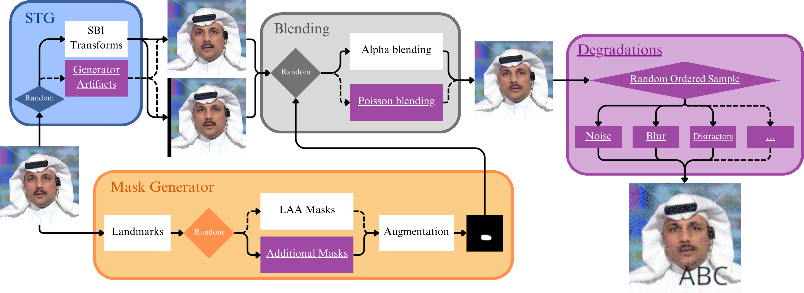

<<<<<<< HEAD
Deepfake Detection Repo
=======
# PMM: Practical Manipulation Model for Robust Deepfake Detection



This is the official implementation for
> [**Practical Manipulation Model for Robust Deepfake Detection**](https://www.arxiv.org/abs/2506.05119), \
> Benedikt Hopf and Radu Timofte, \
> *ICCVW AIM 2025*


## Abstract
Modern deepfake detection models have achieved strong performance even on the challenging cross-dataset task. However, detection performance under non-ideal conditions remains very unstable, limiting success on some benchmark datasets and making it easy to circumvent detection. Inspired by the move to a more real-world degradation model in the area of image super-resolution, we have developed a Practical Manipulation Model (PMM) that covers a larger set of possible forgeries. We extend the space of pseudo-fakes by using Poisson blending, more diverse masks, generator artifacts, and distractors. Additionally, we improve the detectors' generality and robustness by adding strong degradations to the training images. We demonstrate that these changes not only significantly enhance the model's robustness to common image degradations but also improve performance on standard benchmark datasets. Specifically, we show clear increases of 3.51% and 6.21% AUC on the DFDC and DFDCP datasets, respectively, over the s-o-t-a LAA backbone. Furthermore, we highlight the lack of robustness in previous detectors and our improvements in this regard.


## Recommended Environment

We recommed using [Docker](https://www.docker.com/) as the development environment. We provide a Dockerfile, that can be used for the setup.

We trained the model on NVIDIA RTX 3090 and 4090 cards, which have 24GB of VRAM. 


## Pre-Trained models
TODO


## Setup
This codebase is an adaptation of [LAA-Net](https://github.com/10Ring/LAA-Net). Please follow the instruction for setup of [LAA-Net](https://github.com/10Ring/LAA-Net), using our provided Dockerfile.

Mount this repository to `/workspace` inside the container and the folder where you keep the datasets to `/data`. These paths can also be changed in the `configs/train.yaml` and `configs/test.yaml` files. 
        
## Training

With the docker container created as described and the paths mounted, simply run

```shell
python scripts/train.py --cfg configs/train.yaml
```

All hyperparameters can be set in `config/train.yaml`.

If you want to use generator artifacts, you need to provide your reencoded images. They are expected to be in a folder next to `FaceForensics++/train/frames/aligned_Original_81/` as `FaceForensics++/train/frames/aligned_Original_81_gan/` and `FaceForensics++/train/frames/aligned_Original_81_sd/` (if you do not use `aligned_Original_81`, just append your name by `_gan` and `_sd`). All images in that folder should have the same filename as their original version, but ending with `.gan.jpg` or `.sd.jpg`. Refer to `_get_generated_image_path()` in `datasets/face_forensics_sbi.py` for the exact implementation of how images are expected to exist.

Note, that we do not provide our images, as we do not consider that a dataset, but rather a preprocessing step. Furthermore, the copyright for FaceForensics++ lies with the authors and not us.

## Testing


Testing works in the same way:
```shell
python scripts/test.py --cfg configs/test.yaml
```


## Contact
For any questions please file an issue or write to the author [Benedikt Hopf](mailto:benedikt.hopf@uni-wuerzburg.de)


## License

The license information from LAA is available in the folder `LAA-license`

For PMM code: 

```
Copyright (c) 2025 Computer Vision Lab, University of Wurzburg
Licensed under CC BY-NC-SA 4.0 (Attribution-NonCommercial-ShareAlike 4.0 International) (the "License"); you may not use this file except in compliance with the License.
You may obtain a copy of the License at

https://creativecommons.org/licenses/by-nc-sa/4.0/legalcode

The code is released for academic research use only. For commercial use, please contact Computer Vision Lab, University of Wurzburg.
Unless required by applicable law or agreed to in writing, software distributed under the License is distributed on an "AS IS" BASIS, WITHOUT WARRANTIES OR CONDITIONS OF ANY KIND, either express or implied.
See the License for the specific language governing permissions and limitations under the License.
```

## Acknowledgement

This code is based on the [code repository of LAA-Net](https://github.com/10Ring/LAA-Net). For the degradations, we used large parts of the [practical degradation model](https://github.com/cszn/BSRGAN).


## Citation

```bibtex
@misc{hopf2025pmm,
      title={Practical Manipulation Model for Robust Deepfake Detection}, 
      author={Benedikt Hopf and Radu Timofte},
      year={2025},
      eprint={2506.05119},
      archivePrefix={arXiv},
      primaryClass={cs.CV},
      url={https://arxiv.org/abs/2506.05119}, 
}
```
>>>>>>> First commit
